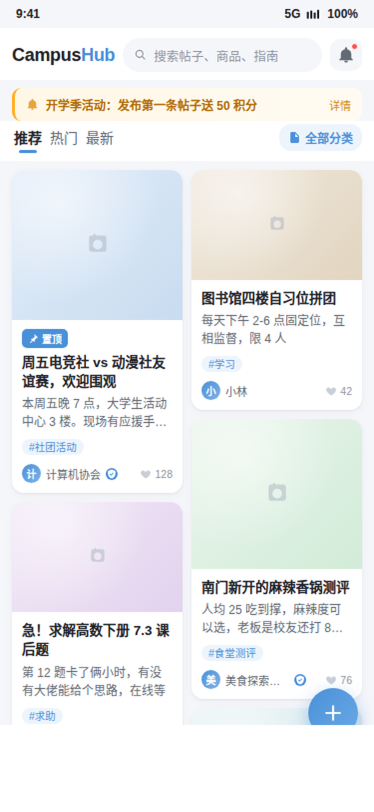
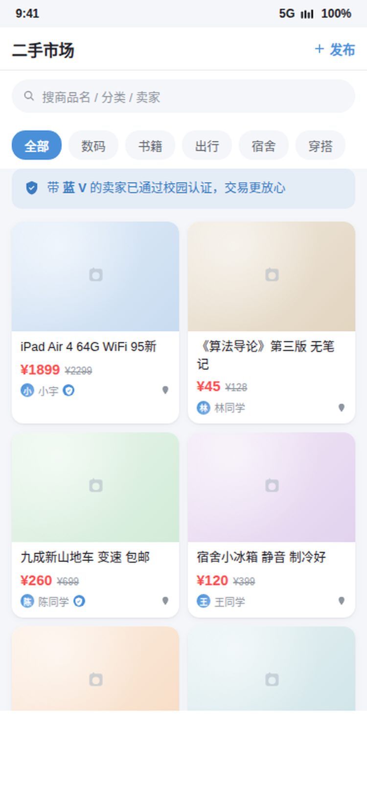
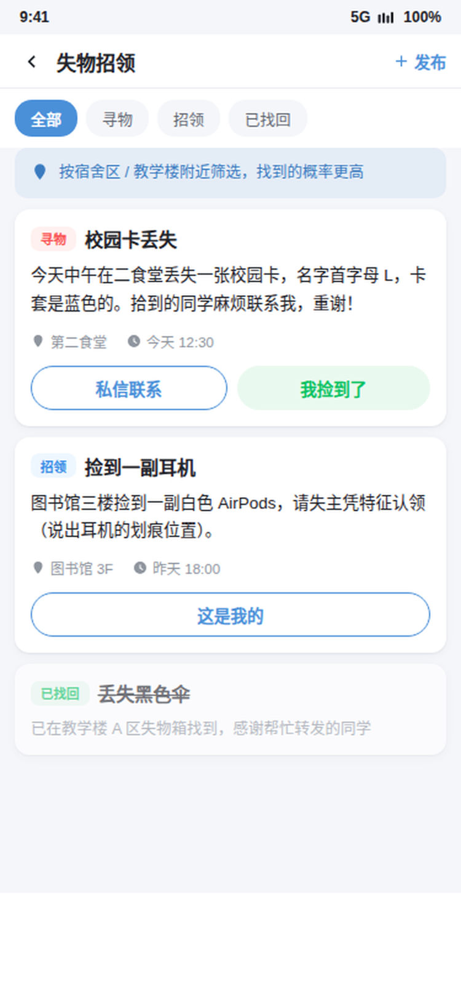
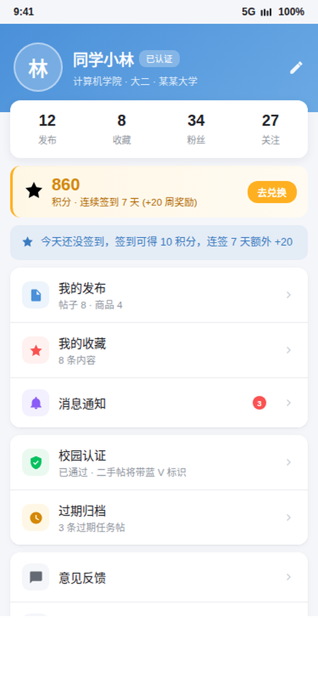
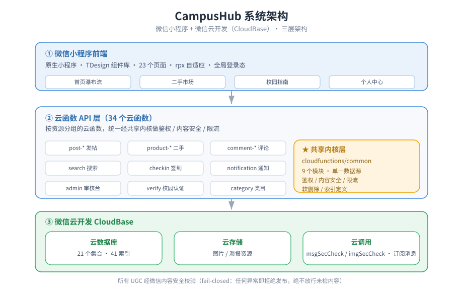
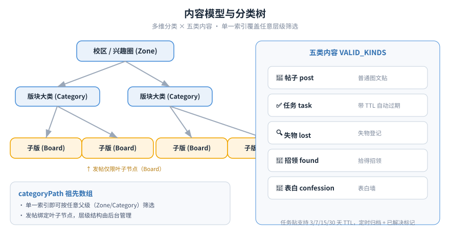

<p align="center"></p>

# CampusHub

> **An open-source campus & interest content community built on WeChat Mini Program + CloudBase — a modern, open forum for campuses and interest groups.**
> Multi-level categories, posts, second-hand market, threaded comments, check-in streaks, follows, content moderation, and an admin console — ready out of the box, near-zero cost.

<p align="center">
  <a href="./LICENSE"></a>
  <a href="./CHANGELOG.md"></a>
  <a href="https://developers.weixin.qq.com/miniprogram/dev/wxcloud/basis/getting-started.html"></a>
  <a href="https://gitcode.com/badhope/campushub"></a>
  <a href="./CONTRIBUTING.md"></a>
</p>

<p align="center">
  📖 <a href="./docs/USER_GUIDE.md">使用说明书</a> ｜
  🚀 <a href="./docs/DEPLOY.md">部署上线指南</a> ｜
  💰 <a href="./docs/COST.md">成本方案</a> ｜
  ⚖️ <a href="./docs/COMPLIANCE.md">合规要点</a> ｜
  🇨🇳 <a href="./docs/README.zh-CN.md">中文文档</a> ｜
  🌐 <a href="./index.html">Landing Page</a>
</p>

> If this project helps you, please give it a ⭐ **Star** on <a href="https://gitcode.com/badhope/campushub">GitCode</a> so more campuses can find it. Issues and PRs are welcome.

---

## 📸 Screenshots / 截图

<p align="center">
  
  
  
  
</p>

<p align="center">
  <a href="./docs/screenshots/overview.png"><b>查看 24 页总览长图（1634×6170）</b></a> ｜
  <a href="./docs/screenshots/demo.mp4"><b>观看使用视频（37s）</b></a> ｜
  <a href="./docs/preview.html"><b>打开可交互原型</b></a>
</p>

- 📁 **24 张单页高清截图（750×1624）**：[`docs/screenshots/`](./docs/screenshots/)
- 🛠️ **界面与后端优化方案**：[`docs/OPTIMIZATION_PLAN.md`](./docs/OPTIMIZATION_PLAN.md)

---

## 🎯 Overview / 项目简介

CampusHub 是一个基于 **微信小程序 + 微信云开发（CloudBase）** 的开源校园内容社区。采用「**一校一部署**」模式：每个学校/组织独立部署一套环境，学生在多层级分类树下发帖、提问、交易、互动。

| 核心能力 | 说明 |
|---|---|
| **多级分类** | Zone（校区/兴趣圈）→ Category（版块大类）→ Board（子版），后台 UI 即可调整，无需改代码 |
| **多元内容** | 帖子、任务、失物、招领、表白、二手商品、校园指南等 7 类内容 |
| **完整闭环** | 发帖 → 评论 → 点赞收藏 → 关注 → 通知 → 管理审核，覆盖社区全链路 |
| **安全优先** | 所有 UGC 经微信 `msgSecCheck` / `imgSecCheck`，**fail-closed**：任何异常即拒绝发布 |
| **近零成本** | 云开发免费额度起步，生产环境 19.9 元/月起 |



### 为谁而建？

| 👤 角色 | 典型场景 | 关键页面 |
|---|---|---|
| 普通学生 | 刷帖、找二手、看指南、评论互动 | 首页 / 帖子详情 / 搜索 |
| 卖家 | 发布闲置、管理在售、标记已售 | 发布商品 / 我的发布 / 商品详情 |
| 买家 | 搜索商品、联系卖家、收藏比价 | 二手市场 / 商品详情 / 通知 |
| 失主 / 拾主 | 发布失物或招领信息 | 发帖（失物/招领）|
| 管理员 | 审核举报、置顶公告、用户管理 | 审核台 / 校园认证 / 反馈 |

---

## 🏗️ Architecture / 系统架构

系统由 **微信小程序前端 → 云函数 API 层 → 微信云开发后端** 三层构成。

- **前端**：原生小程序，使用 TDesign 组件库，23 个页面，rpx 自适应，全局登录态
- **API 层**：34 个云函数，按资源（post / product / comment / user 等）分组
- **共享内核**：`cloudfunctions/common/` 下 9 个模块（auth / security / rate / db / context / content / indexes / bundle / error），通过 `common-bundle.js` 一行的方式同步到所有云函数，保证单一数据源、零漂移
- **后端**：CloudBase 云数据库（21 集合 / 44 索引）、云存储、云调用（内容安全、订阅消息）

---

## 🧩 Data Model / 内容模型



- **分类树 3 级**：`Zone → Category → Board`，后台可直接增删改，运营动作无需发版
- **`categoryPath` 祖先数组**：任一节点都保存从根到自身的路径 ID，**单一索引即可按任意父级筛选**，同时强制发帖必须选择叶子节点 `Board`
- **内容类型 `VALID_KINDS`**：`post` 帖子、`task` 任务、`lost` 失物、`found` 招领、`confession` 表白墙；任务帖支持 3/7/15/30 天 TTL 自动归档

---

## ✨ Features / 核心特性

| 特性 | 描述 |
|---|---|
| 🌳 **多级分类** | Zone → Category → Board（3 级）；`categoryPath` 祖先数组支持任意层级筛选；发帖限定叶子节点 |
| 🏠 **Feed 首页** | 双列瀑布流（帖子 + 商品）；推荐 / 热门 / 最新 Tab；分类筛选；过期归档入口 |
| 📝 **富文本帖子** | 图文混排、分类、标签、匿名发帖、草稿箱、图片预览 |
| ⏳ **任务与过期** | 任务帖支持 3/7/15/30 天 TTL；6 小时 cron 自动归档过期任务；作者/管理员可标记「已解决」|
| 🛒 **二手市场** | 商品列表、价格/成色/交易方式、联系信息、标记已售、编辑商品 |
| 💬 **嵌套评论** | 楼层 + 子回复、评论点赞、@ 回复 |
| 👥 **关注系统** | 关注/取关、粉丝/关注数、个人主页 |
| 📅 **每日签到** | 连续签到 + 积分 + 每周奖励 |
| 🔔 **站内通知** | 点赞、评论、关注自动生成通知 |
| 📚 **校园指南** | 新生指南、学习攻略等文章，支持分类筛选 |
| 🔍 **搜索** | 跨集合搜索（帖子 / 商品 / 指南），标题 + 正文匹配，关键词高亮 |
| 👤 **用户主页** | 公开资料、最近发布、关注按钮 |
| 🛡️ **内容安全** | 全部 UGC 经微信内容安全接口；**fail-closed**：异常/超限/违规均拒绝发布 |
| ⚙️ **管理后台** | 举报审核、封禁/解封、置顶/精华、用户列表、反馈管理、类目 CRUD、公告管理、操作审计 |
| 🗂️ **类目管理** | 后台 UI 直接添加学校/分类/子版，纯运营动作，无需发版 |
| 📣 **公告栏** | 管理员发布，首页顶部展示 ≤3 条，支持置顶 |
| 🪙 **积分商城** | 签到积分兑换改名卡，首次改名免费 |
| 💾 **自动备份** | 每日 03:00 自动快照核心集合到 `backups`，保留 7 天 |
| 📋 **管理审计** | 封禁/删除/置顶/认证等敏感操作写入 `admin_logs`，后台可查 |
| 🖼️ **分享海报** | 一键生成 Canvas 分享卡片，保存到相册 |
| 🔥 **搜索限流 + 热词** | 服务端按用户限流（10s/3），热词聚合最近 7 天搜索 |
| 📜 **游标分页** | 最新 feed 与评论使用游标分页，深层滚动不丢序 |

---

## ⚙️ Tech Stack / 技术栈

| 层级 | 技术 |
|---|---|
| 前端框架 | 原生微信小程序（WebView 渲染） |
| UI 组件库 | TDesign Mini Program |
| 后端服务 | 微信云开发 Cloud Functions |
| 数据存储 | 微信云数据库 + 云存储 |
| 开放能力 | 微信登录、内容安全 `msgSecCheck` / `imgSecCheck`、订阅消息、Canvas |
| 构建工具 | 微信开发者工具 + npm |
| 同步脚本 | `scripts/sync-common.js`（9 个公共模块自动同步到 34 个云函数） |

---

## 📊 Project Stats / 项目规模

| 指标 | 数量 |
|---|---|
| 云函数 | 37 |
| 小程序页面 | 22 |
| 数据库集合 | 21 |
| 已定义索引 | 44 |
| 公共模块 | 9（同步到 34 个云函数） |

---

## 📂 Directory Structure / 目录结构

```
CampusHub/
├── miniprogram/              # 小程序前端
│   ├── app.js                # 入口（CloudBase 初始化）
│   ├── app.json              # 全局配置
│   ├── app.wxss              # 全局样式 + Design Tokens
│   ├── pages/                # 23 个页面
│   ├── components/           # 共享组件（如 category-picker）
│   └── utils/                # 工具（请求、鉴权）
├── cloudfunctions/           # 34 个云函数
│   ├── common/               # ★ 共享内核层（单一数据源）
│   │   ├── common-bundle.js  # 一行的聚合导出
│   │   ├── common-context.js # 用户上下文 & 鉴权
│   │   ├── common-security.js# fail-closed 内容安全
│   │   ├── common-rate.js    # 限流
│   │   ├── common-db.js      # 数据库单例
│   │   ├── common-content.js # 内容删除（软删 + 图片回收 + 计数回滚）
│   │   ├── common-indexes.js # 索引定义
│   │   └── common-error.js   # 统一错误模型
│   ├── post-create/          # 发帖
│   ├── product-create/       # 发布商品
│   ├── admin/                # 管理后台
│   └── ...
├── docs/
│   ├── DEPLOY.md             # ★ 部署指南（10 步）
│   ├── USER_GUIDE.md         # 使用说明书
│   ├── INDEXES.md            # 索引检查清单
│   ├── SYNC.md               # 多平台同步说明
│   ├── screenshots/          # ★ 截图 / 视频 / 展示索引
│   ├── preview.html          # 可交互 HTML 原型
│   ├── architecture.svg      # 系统架构图
│   ├── data-model.svg        # 内容模型与分类树
│   └── OPTIMIZATION_PLAN.md  # UI/UX 与后端优化方案
├── scripts/
│   ├── sync-common.js        # 同步 common/ 到各云函数
│   └── SYNC.md               # 手动同步指南
├── .github/workflows/         # CI / CD
├── project.config.json       # 微信开发者工具配置
├── package.json              # npm 依赖 + sync:common 脚本
├── LICENSE                   # Apache-2.0
└── README.md                 # 本文件
```

---

## 🚀 Quick Start / 快速开始

> 完整部署指南见 [`docs/DEPLOY.md`](./docs/DEPLOY.md) —— 从 AppID 到上线的 10 步。

```bash
# 1. 安装依赖（会自动执行 sync:common 同步公共模块）
npm install

# 2. 在微信开发者工具中：工具 → 构建 npm

# 3. 填写你的小程序 AppID 到 project.config.json
# 4. 填写你的云开发环境 ID 到 miniprogram/app.js
# 5. 右键每个云函数 → 上传并部署：云端安装依赖
# 6. 配置管理员 OpenID（云函数环境变量 ADMIN_OPENIDS）
# 7. 调用一次 init-db 云函数（创建集合 + 种子数据 + 索引检查）
# 8. 在云开发控制台手动创建 32 个索引（或按 docs/INDEXES.md 核对）
# 9. 预览 & 测试
# 10. 微信开发者工具：上传 → 提交审核 → 发布
```

---

## 🛡️ Design Principles / 设计原则

- **匿名发帖**：帖子/评论支持匿名；商品不允许匿名，便于建立交易信任
- **Fail-closed 内容安全**：内容安全 API 异常/超限/违规 → 一律拒绝发布，不让任何未检内容通过
- **集中封禁**：`requireActiveUser()` 统一拦截所有写操作，检查封禁状态，不在各函数里散落校验
- **单一删除入口**：`removeContent()` 统一处理软删除 + 云存储图片回收 + 计数回滚 + 管理员覆盖
- **分类索引复用**：`categoryPath` 祖先数组让一个索引覆盖任意层级筛选
- **任务生命周期**：`task-expire` cron 排除已解决任务，`resolve` 严格校验帖子状态
- **索引自检**：`init-db` 对比 `common-indexes.js` 与线上索引，输出 `missingIndexes`
- **软删除优先**：删除只改 `status='deleted'`，保留数据可追踪性
- **搜索安全**：关键词正则转义 + 20 字符限制，避免 ReDoS / 注入
- **成本可控**：开发期使用云开发免费环境，生产环境 19.9 元/月起

---

## 🌐 Mirrors & Sync / 多平台镜像

本项目以 **Apache License 2.0** 开源，并镜像到以下平台：

| 平台 | 地址 | 说明 |
|---|---|---|
| **GitCode** | [gitcode.com/badhope/campushub](https://gitcode.com/badhope/campushub) | 主源（当前可访问） |
| **Gitee** | [gitee.com/badhope/campushub](https://gitee.com/badhope/campushub) | 国内镜像 |
| GitHub | github.com/Morningstar202604/campushub | ⚠️ 当前 404，同步前请确认 |

同步采用本地一次提交、多远端推送的方式，详见 [`docs/SYNC.md`](./docs/SYNC.md)。

---

## 🤝 Contributing / 贡献

欢迎提交 Issue 和 PR。请先阅读 [`CONTRIBUTING.md`](./CONTRIBUTING.md) 了解开发环境、代码规范和提交流程。

---

## 📝 Changelog / 更新日志

详见 [`CHANGELOG.md`](./CHANGELOG.md)。

**Latest: v0.8.1**

---

## 仓库地址

四平台并列同步（同分支、同标签、同 HEAD），不分主次，任意选用：

| 平台 | 地址 |
|---|---|
| GitHub | <https://github.com/x33834/campushub> |
| GitHub | <https://github.com/Morningstar202604/campushub> |
| GitCode | <https://gitcode.com/badhope/campushub> |
| Gitee | <https://gitee.com/badhope/campushub> |

## ⚖️ License / 许可证

[Apache License 2.0](./LICENSE) © 2026 Morningstar202604. See [NOTICE](./NOTICE) for details.
