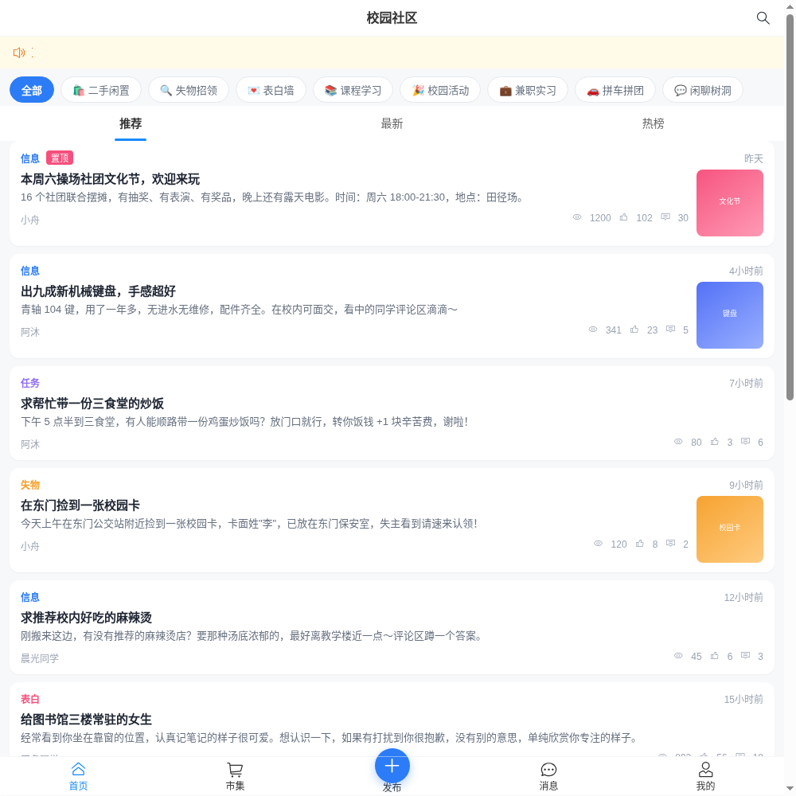
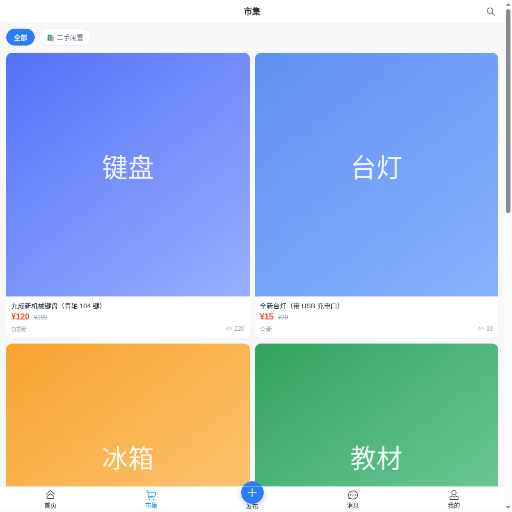
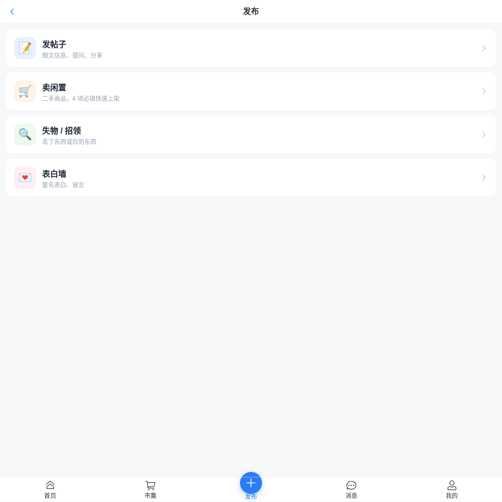
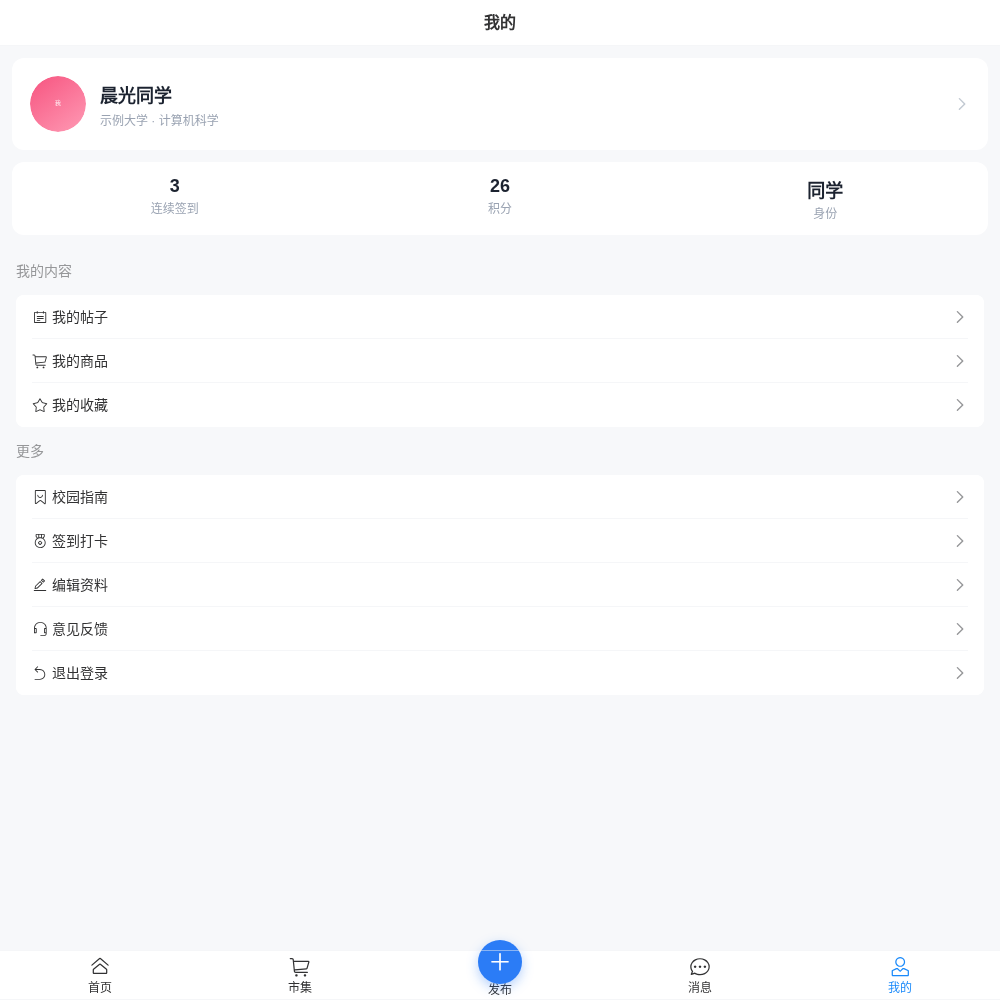
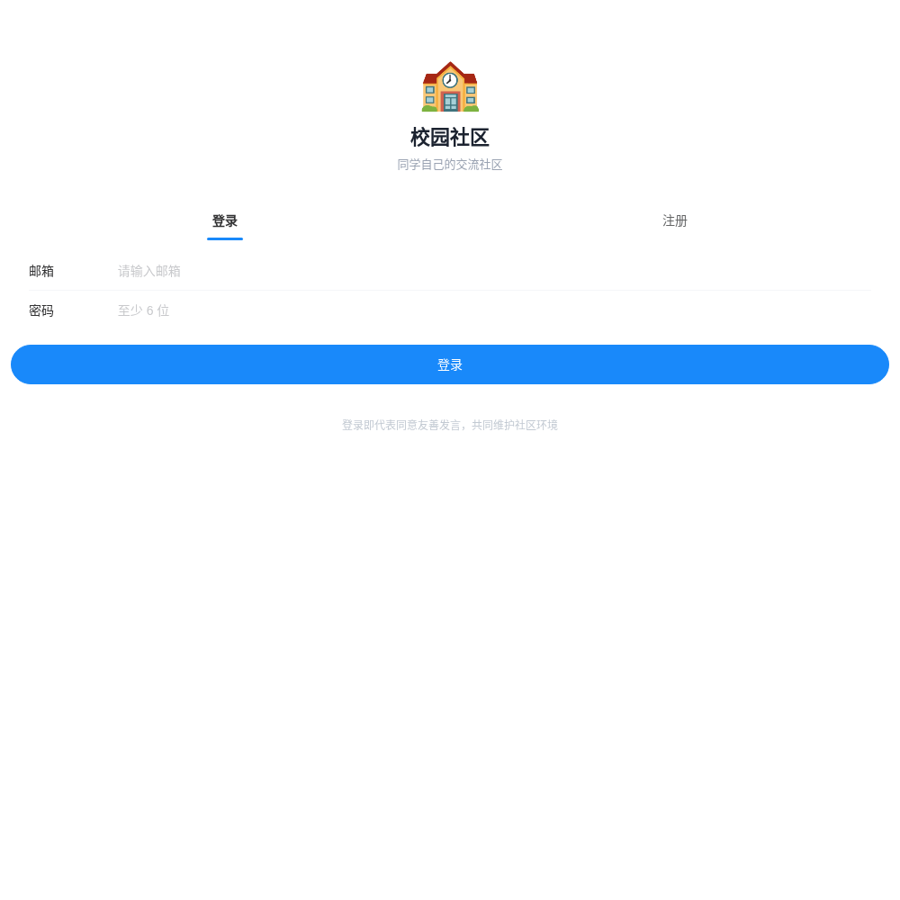

<div align="center">

# 🎓 CampusHub — Open-Source Campus Community Platform

**A production-grade, self-hosted campus community built with Vue 3 + NestJS + PostgreSQL — marketplace, lost & found, confession wall, guides, check-in gamification, notifications, and admin moderation, all in one deployable codebase.**

[](LICENSE)
[](https://vuejs.org)
[](https://nestjs.com)
[](https://www.typescriptlang.org)
[](https://www.postgresql.org)
[](CONTRIBUTING.md)

**English** · [简体中文](#简体中文) · [Docs](docs/) · [Report Bug](https://github.com/X33834/campushub/issues) · [Request Feature](https://github.com/X33834/campushub/issues)

</div>

---

## ✨ What is CampusHub?

CampusHub is a **self-hosted open-source campus community platform** designed for college students and campus organizations. One mobile-first H5 app covers the daily high-frequency scenarios of student life:

- 🛒 **Second-hand marketplace** — sell textbooks, bikes, dorm gear with price/condition/trade-method metadata
- 🔍 **Lost & found** — post found items or lost requests, mark as resolved
- 💌 **Confession wall** — anonymous posting
- 📚 **Course learning, campus events, part-time jobs, carpooling, chat zones** — 8 content categories in total
- 📖 **Campus guides** — category navigation + Markdown rich text
- ⭐ **Check-in gamification** — daily +1 points, 7-day streak bonus, server-side anti-duplicate
- 🔔 **Notifications** — likes, comments, system broadcasts, unread badge
- 🛡️ **Full admin console** — content moderation, reports, user management, announcements, audit logs

**No third-party BaaS lock-in.** The business logic lives entirely in your own code: a self-built **NestJS service layer** with Prisma + PostgreSQL, a **Vue 3 student H5**, and a **vue-pure-admin based management console**. Any school, club, or organization can deploy it on their own server.

> 🏫 Perfect for: campus IT clubs, student unions, open-source learning, full-stack practice, graduation projects, and production deployments.

---

## 📸 Screenshots

| Home Feed | Marketplace | Publish | Profile |
|:---:|:---:|:---:|:---:|
|  |  |  |  |

<details>
<summary>🗂 More screenshots (admin console & login)</summary>

| Admin Console | Login |
|:---:|:---:|
|  |  |

</details>

---

## 🚀 Feature Highlights

**Student H5 (Vue 3 + Vant 4)**
- Home feed with **recommended / latest / hot** rankings, 8-category horizontal filter, pinned & essence markers
- Marketplace grid with price / condition / trade-method display + anti-fraud tips
- 4-scenario publish forms (post / sell / lost & found / anonymous confession), up to 9 images with **client-side compression + upload progress**
- Post detail: image preview, like, collect, comment, reply, report; resolve lost/task posts
- Unified search across posts & products
- Check-in with server-side transactional anti-duplicate
- Email + password auth with **JWT dual-token** (in-memory access + persisted refresh, auto-renewal)

**Service Layer (NestJS + Prisma)**
- 13 business modules: auth · categories · posts · comments · interactions · products · checkins · announcements · guides · notifications · feedbacks · search · upload
- 41+ REST endpoints, uniform `{code, message}` error body, `{list, total, hasMore}` pagination, **soft-delete everywhere**
- Interactive counters maintained in the **same transaction** as the mutation (comments, likes, collects)
- OpenAPI docs at `/api-docs` (Swagger UI) + JSON feed for frontend type generation

**Engineering Practices (aligned with top open-source projects)**
- Single source of truth for frontend types: `openapi-typescript` generates `api.d.ts` from the backend swagger
- Session security: access token in memory only (XSS-resistant), refresh token persisted, **401 single-flight renewal + request replay**
- Mock/real dual-track: `VITE_USE_MOCK` switches demo data vs real backend with the same `lib/http.ts` facade
- Image client compression (max 1600px / JPEG 0.85) + XHR upload progress
- Lightweight telemetry skeleton + global error monitoring + page-view events
- History-mode routing (no `#`), page transitions, skeleton screens, dark mode
- Unit tests for core service logic (check-in anti-duplicate / streak / break / points)

---

## 🧱 Tech Stack

| Layer | Technology |
|---|---|
| Student H5 | Vue 3 · Vite · TypeScript · Pinia · Vant 4 |
| Service Layer | NestJS · Prisma ORM · Swagger/OpenAPI |
| Admin Console | vue-pure-admin (Vue 3 + Element Plus) |
| Database | PostgreSQL (19 tables, unique constraints, counter columns) |
| Auth | JWT dual-token (access in-memory + refresh persisted) |

---

## ⚡ Quick Start

### Option A: Try it instantly with mock data ★

No backend, no keys — the student H5 ships with a built-in **mock data mode**. Open it and browse the full community; publish / comment / check-in / collect all work (data stored in browser localStorage).

```bash
cd apps/web
npm install
VITE_USE_MOCK=true npm run dev      # dev mode
# or build & preview
VITE_USE_MOCK=true npm run build && npx vite preview --port 4173
```

Mock mode ships with 8 categories, guides, demo posts, products, comments, notifications. **Any email + any password logs you in.**

### Option B: Full stack with real backend (NestJS + PostgreSQL)

```bash
# 0. Prereqs: Node 20+ and PostgreSQL 14+ on your machine
cd apps/server

# 1. Create DB + tables + seed + demo data
bash scripts/setup-db.sh                 # create database & user
node scripts/seed.mjs                    # seed: 8 categories / 1 announcement / guides
bash scripts/make-demo.sh                # demo: two accounts / 4 posts / 3 products / interactions

# 2. Start the service layer (:3000)
npm run build && node dist/main.js

# 3. Start the student H5 (:4173)
cd ../web
npm install
npm run dev
```

**Demo accounts**: `xiaoming@campus.dev` / `xiaohong@campus.dev` · password `demo123456`

**API docs**: open `http://localhost:3000/api-docs` (Swagger UI) after the server starts.

> Full deployment guide (server, env vars, SPA fallback): **[docs/DEPLOY.md](./docs/DEPLOY.md)**

---

## 📁 Project Structure

```
campushub/
├── apps/
│   ├── web/            # Student H5 (Vue 3 + Vant)
│   ├── server/         # Service layer (NestJS + Prisma + PostgreSQL)
│   └── admin/          # Admin console (vue-pure-admin)
├── packages/db/        # DB scripts (v1 legacy reference)
├── docs/               # DEPLOY / ARCHITECTURE / QA-REPORT / ADMIN / REFACTOR-PLAN / M0-API-SPEC
├── site/               # Official site (single HTML, no framework deps)
└── README.md
```

Architecture & key flows: **[docs/ARCHITECTURE.md](./docs/ARCHITECTURE.md)**

---

## 🗺 Roadmap

| Milestone | Scope | Status |
|---|---|---|
| M0 | API contract + schema review + test strategy | ✅ Done (41 endpoints frozen) |
| M1 | NestJS service layer + full student app integration | ✅ Done (13 modules / 19 tables / API smoke passed) |
| M1+ | Engineering debt: sessions, type generation, mock dual-track, telemetry, dark mode (12 items) | ✅ Done |
| M1+ admin | Admin console migrated to self-built service layer (28 endpoints, real AdminGuard, audit logs) | ✅ Done |
| M2 | Machine review API + Sentry + structured logging (production baseline) | ⏳ Planned |
| M3 | Mini-program client (uni-app, reusing the service layer) | ⏳ Planned |
| M4 | Redis cache + BullMQ async + search upgrade | ⏳ Planned |
| M5 | Telemetry analytics + personalized recommendation baseline | ⏳ Planned |

---

## 📚 Documentation

| Doc | Description |
|---|---|
| [DEPLOY.md](docs/DEPLOY.md) | Server deployment, env vars, SPA fallback |
| [ARCHITECTURE.md](docs/ARCHITECTURE.md) | System architecture, key flows, data model |
| [ADMIN.md](docs/ADMIN.md) | Admin console setup & API reference |
| [QA-REPORT.md](docs/QA-REPORT.md) | Smoke tests, regressions, known limits |
| [CAMPUSHUB-REFACTOR-PLAN.md](docs/CAMPUSHUB-REFACTOR-PLAN.md) | Refactor rationale, cost, trade-offs |
| [M0-API-SPEC.md](docs/M0-API-SPEC.md) | API contract (41 endpoints) |
| [CONTRIBUTING.md](CONTRIBUTING.md) | Contribution guide |
| [CHANGELOG.md](CHANGELOG.md) | Version history |
| [SECURITY.md](SECURITY.md) | Security policy & reporting |

---

## 🤝 Contributing

Contributions of all kinds are welcome — features, bug reports, docs, translations, and design. Please read [CONTRIBUTING.md](CONTRIBUTING.md) first and follow our [Code of Conduct](CODE_OF_CONDUCT.md).

1. Fork the repo
2. Create your feature branch (`git checkout -b feat/amazing`)
3. Commit your changes (`git commit -m 'feat: add amazing thing'`)
4. Push to the branch (`git push origin feat/amazing`)
5. Open a Pull Request

---

## 📄 License

[MIT](LICENSE) © 2026 CampusHub Contributors. Free for any school or organization to use, modify, and deploy — including commercial use.

---

<a id="简体中文"></a>

# 简体中文

## 🎓 CampusHub · 校园内容社区（开源）

面向在校学生的**自托管开源校园社区平台**：二手市集、失物招领、表白墙、课程学习、校园活动、兼职拼车、校园指南、签到积分、消息通知、举报闭环——一套 H5 全部搞定。**自建 NestJS 服务层**，不依赖任何第三方 BaaS，任何学校 / 组织可一键部署。

**技术栈**：Vue 3 + Vite + TS + Pinia + Vant 4（学生端）· NestJS + Prisma + PostgreSQL（服务层）· vue-pure-admin（管理后台）

### 功能清单

- 首页信息流：推荐 / 最新 / 热榜三种排序，八分类横滑筛选，公告栏，置顶 / 精华标识
- 市集：二手商品网格、价格 / 成色 / 交易方式展示、防诈骗提示、点赞 / 收藏 / 评论
- 发布：四场景表单（发帖子 / 卖闲置 / 失物招领 / 匿名表白墙），最多 9 图上传（客户端压缩 + 进度条）
- 帖子详情：图片预览、点赞、收藏、评论、回复、举报；失物 / 任务可标记解决
- 搜索：帖子 + 商品统一搜索
- 校园指南：分类导航 + Markdown 富文本（DOMPurify 渲染）
- 签到打卡：每日 +1 积分，连续 7 天额外 +5，断签重计（服务端事务防重）
- 消息中心：点赞 / 评论 / 系统通知，未读红点
- 管理后台：内容审核（帖子 / 商品 / 评论）、举报处理、用户管理、分类 / 公告 / 指南管理、反馈、通知下发、**操作审计**（全部走自建服务层 28 端点 + 真 AdminGuard）

### 快速开始

```bash
# 方式 A：学生端 mock 演示（无需后端）
cd apps/web && npm install && VITE_USE_MOCK=true npm run dev

# 方式 B：完整跑真实后端
cd apps/server && bash scripts/setup-db.sh && node scripts/seed.mjs && bash scripts/make-demo.sh
npm run build && node dist/main.js
cd ../web && npm install && npm run dev
```

演示账号：`xiaoming@campus.dev` / `xiaohong@campus.dev`，密码 `demo123456`。接口文档：`http://localhost:3000/api-docs`。

### 测试与边界（如实标注）

- 服务层核心单测全绿；全 API 冒烟实测通过（注册 → 登录 → 发帖 → 评论 → 点赞 → 签到 → 市集 → 搜索）；管理后台 12 页浏览器端到端验证，写操作（置顶 / 封禁 / 举报闭环）闭环通过
- 图片暂存本地磁盘（`apps/server/uploads`，`/static/` 提供），后置 OSS / CDN
- 机审 API、Sentry、Redis、小程序端为路线图 M2–M5，当前未实现（如实标注，不夸大）

### 许可证

MIT © 2026 CampusHub Contributors。完全开源，欢迎任何学校 / 组织使用与二次开发（含商业使用）。

---

<div align="center">
<sub>Built with ❤️ for campus communities · ⭐ Star us if you find it useful!</sub>
</div>
